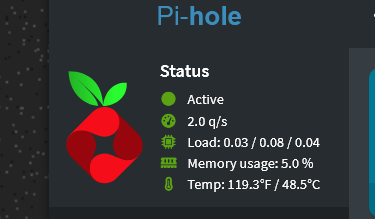

# pihole-cputemp

Display Raspberry Pi CPU temperature in the Pi-hole V6 web admin interface.

This project adds a small custom JavaScript hook to the Pi-hole admin UI and updates a local JSON file with the current CPU temperature every 30 seconds using a systemd timer.

It is designed for Raspberry Pi-based Pi-hole installs where you want the Pi-hole dashboard to show the system CPU temperature without installing a full monitoring stack.

## Screenshot



## What it does

- Reads CPU temperature from:

  ```text
  /sys/class/thermal/thermal_zone0/temp
  ```

- Writes temperature data to:

  ```text
  /var/www/html/admin/custom/cputemp.json
  ```

- Adds a custom JavaScript file to the Pi-hole admin interface:

  ```text
  /var/www/html/admin/custom/cputemp.js
  ```

- Injects the JavaScript into Pi-hole's footer file:

  ```text
  /var/www/html/admin/scripts/lua/footer.lp
  ```

- Displays temperature in both Fahrenheit and Celsius.
- Refreshes the displayed temperature every 30 seconds.
- Uses a systemd timer to keep the JSON temperature file updated.
- Uses a systemd path watcher to reapply the Pi-hole UI hook if Pi-hole updates overwrite the footer.
- Adds an apt post-invoke hook so the customization is reapplied after package operations.

## Example display

After installation, the Pi-hole admin interface should show a temperature line similar to:

```text
Temp: 118.4°F / 48.0°C
```

## Project layout

```text
apt/
  99-pihole-cputemp-reapply

custom/
  cputemp.js

systemd/
  pihole-cputemp-json.service
  pihole-cputemp-json.timer
  pihole-cputemp-reapply.path
  pihole-cputemp-reapply.service

install.sh
pihole-update
reapply-pihole-cputemp
write-pihole-cputemp-json
```

## Requirements

- Raspberry Pi or compatible Linux system exposing CPU temperature at:

  ```text
  /sys/class/thermal/thermal_zone0/temp
  ```

- Pi-hole installed with the admin web interface.
- systemd.
- Root access.

This was written for a Raspberry Pi running Pi-hole on Debian/Raspberry Pi OS.

## Installation

Clone the repository:

```bash
cd /usr/local/src
git clone https://github.com/gelsbern/pihole-cputemp.git
cd pihole-cputemp
```

Run the installer as root:

```bash
sudo ./install.sh
```

The installer copies the scripts, JavaScript, systemd units, and apt hook into place, then enables the required systemd timer and path watcher.

## Installed files

The installer places files here:

```text
/usr/local/sbin/write-pihole-cputemp-json
/usr/local/sbin/reapply-pihole-cputemp
/usr/local/sbin/pihole-update
/var/www/html/admin/custom/cputemp.js
/etc/systemd/system/pihole-cputemp-json.service
/etc/systemd/system/pihole-cputemp-json.timer
/etc/systemd/system/pihole-cputemp-reapply.service
/etc/systemd/system/pihole-cputemp-reapply.path
/etc/apt/apt.conf.d/99-pihole-cputemp-reapply
```

## Services and timers

### Temperature JSON updater

The timer runs every 30 seconds and updates:

```text
/var/www/html/admin/custom/cputemp.json
```

Check it with:

```bash
systemctl status pihole-cputemp-json.timer
systemctl status pihole-cputemp-json.service
```

Manually run it with:

```bash
sudo systemctl start pihole-cputemp-json.service
```

### Pi-hole footer reapply watcher

The path watcher monitors Pi-hole's footer file and reapplies the custom script include if needed.

Check it with:

```bash
systemctl status pihole-cputemp-reapply.path
systemctl status pihole-cputemp-reapply.service
```

Manually reapply the customization with:

```bash
sudo /usr/local/sbin/reapply-pihole-cputemp
```

## Verifying installation

Check that the systemd timer is active:

```bash
systemctl status pihole-cputemp-json.timer
```

Check that the path watcher is active:

```bash
systemctl status pihole-cputemp-reapply.path
```

Check that Pi-hole's footer contains the custom JavaScript include:

```bash
grep -n cputemp.js /var/www/html/admin/scripts/lua/footer.lp
```

Check that the JSON temperature file is being generated:

```bash
curl -s http://127.0.0.1/admin/custom/cputemp.json
```

Example output:

```json
{
  "celsius": "48.0",
  "fahrenheit": "118.4",
  "updated": "2026-06-11T12:00:00-04:00"
}
```

## Updating Pi-hole

This project includes a helper wrapper:

```bash
sudo pihole-update
```

That runs:

```bash
pihole -up
/usr/local/sbin/reapply-pihole-cputemp
```

This helps restore the CPU temperature customization after Pi-hole updates.

The apt hook also attempts to reapply the customization after package operations:

```text
/etc/apt/apt.conf.d/99-pihole-cputemp-reapply
```

## Logs

The reapply script logs to:

```text
/var/log/pihole-cputemp-reapply.log
```

View the log with:

```bash
sudo tail -100 /var/log/pihole-cputemp-reapply.log
```

## Troubleshooting

### Temperature shows as unavailable

Check whether the system exposes the expected temperature file:

```bash
cat /sys/class/thermal/thermal_zone0/temp
```

If that file does not exist, this script may need to be adjusted for your hardware.

### JavaScript is not loading

Check that the custom JavaScript file exists:

```bash
ls -l /var/www/html/admin/custom/cputemp.js
```

Check that Pi-hole's footer includes it:

```bash
grep -n cputemp.js /var/www/html/admin/scripts/lua/footer.lp
```

If missing, reapply manually:

```bash
sudo /usr/local/sbin/reapply-pihole-cputemp
```

### JSON file is not updating

Check the timer:

```bash
systemctl status pihole-cputemp-json.timer
```

Run the writer manually:

```bash
sudo /usr/local/sbin/write-pihole-cputemp-json
cat /var/www/html/admin/custom/cputemp.json
```

## Notes

This customization modifies a Pi-hole admin UI file:

```text
/var/www/html/admin/scripts/lua/footer.lp
```

Pi-hole updates may overwrite that file. This project includes a reapply script, systemd path watcher, apt hook, and update wrapper to help keep the customization in place.

## Adding screenshots

Create an images directory in the repository:

```bash
mkdir -p docs/images
```

Copy your screenshot into that folder, for example:

```text
docs/images/pihole-cputemp-dashboard.png
```

Reference it in Markdown like this:

```markdown

```

Then commit and push the README and image:

```bash
git add README.md docs/images/pihole-cputemp-dashboard.png
git commit -m "Add README and dashboard screenshot"
git push
```

## Uninstalling

To remove the customization:

```bash
sudo systemctl disable --now pihole-cputemp-json.timer
sudo systemctl disable --now pihole-cputemp-reapply.path

sudo rm -f /etc/systemd/system/pihole-cputemp-json.service
sudo rm -f /etc/systemd/system/pihole-cputemp-json.timer
sudo rm -f /etc/systemd/system/pihole-cputemp-reapply.service
sudo rm -f /etc/systemd/system/pihole-cputemp-reapply.path

sudo rm -f /etc/apt/apt.conf.d/99-pihole-cputemp-reapply

sudo rm -f /usr/local/sbin/write-pihole-cputemp-json
sudo rm -f /usr/local/sbin/reapply-pihole-cputemp
sudo rm -f /usr/local/sbin/pihole-update

sudo rm -f /var/www/html/admin/custom/cputemp.js
sudo rm -f /var/www/html/admin/custom/cputemp.json

sudo systemctl daemon-reload
```

Then manually remove this line from:

```text
/var/www/html/admin/scripts/lua/footer.lp
```

```html
<script src="/admin/custom/cputemp.js"></script>
```

Restart Pi-hole FTL afterward:

```bash
sudo systemctl restart pihole-FTL
```

## License

See [LICENSE](LICENSE).
