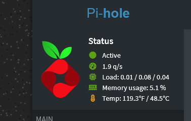
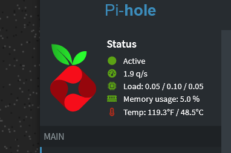

# Pi-hole CPU Temperature Display

Adds a CPU temperature line to the Pi-hole web admin dashboard.

The temperature appears under the existing system stats and updates automatically using a small JSON file generated by a systemd timer.

The thermometer icon changes color based on configurable temperature thresholds:

- Green: normal
- Yellow: warm
- Red: hot

Because staring at a Pi-hole dashboard is more fun when it has tiny warning lights.

---

## Screenshots

### Normal / Green


### Warm / Yellow



### Hot / Red



---

## Features

- Adds CPU temperature to the Pi-hole admin dashboard
- Shows temperature in both Fahrenheit and Celsius
- Uses the existing Pi-hole dashboard style
- Color-coded thermometer icon
- Configurable warning and critical thresholds
- Automatically detects a CPU/SoC thermal zone where possible
- Falls back cleanly if temperature data is unavailable
- Updates temperature every 30 seconds using systemd
- Reapplies the dashboard hook after Pi-hole updates
- Includes a safer `pihole-update` wrapper

---

## How It Works

Linux exposes temperature sensors through thermal zones under:

```text
/sys/class/thermal/
```

For example:

```text
/sys/class/thermal/thermal_zone0/type
/sys/class/thermal/thermal_zone0/temp
```

The `type` file describes the sensor, and the `temp` file contains the temperature in millidegrees Celsius.

Example:

```text
cpu-thermal
45678
```

That means:

```text
45.678°C
```

This project writes the current CPU temperature to:

```text
/var/www/html/admin/custom/cputemp.json
```

The Pi-hole dashboard then reads that JSON file from the browser and displays the temperature.

---

## Thermal Zones

Some Linux systems expose multiple thermal zones:

```text
thermal_zone0
thermal_zone1
thermal_zone2
```

The zone number is not guaranteed to mean the same thing on every system.

For example, depending on the hardware, kernel, and firmware:

```text
thermal_zone0 = CPU / SoC
thermal_zone1 = GPU
thermal_zone2 = NVMe / Wi-Fi / board sensor
```

On many Raspberry Pi systems, `thermal_zone0` is commonly the CPU/SoC temperature, but this is not universal.

This project supports automatic thermal zone detection by checking the thermal zone `type` files and preferring CPU/SoC style sensors.

To inspect available thermal zones manually:

```bash
for z in /sys/class/thermal/thermal_zone*; do
    [ -r "$z/type" ] && [ -r "$z/temp" ] || continue
    printf "%s %-25s %6.1f°C\n" \
        "$(basename "$z")" \
        "$(cat "$z/type")" \
        "$(awk '{print $1/1000}' "$z/temp")"
done
```

Example output:

```text
thermal_zone0 cpu-thermal                45.1°C
thermal_zone1 gpu-thermal                43.7°C
```

---

## Temperature Colors

The thermometer icon changes color based on the configured Celsius thresholds.

Default thresholds:

```text
Green  = below 60°C
Yellow = 60°C through below 70°C
Red    = 70°C and above
```

These are conservative dashboard warning levels.

Raspberry Pi systems typically throttle around higher temperatures, but this project intentionally turns yellow/red earlier so the dashboard gives you a useful heads-up before things get spicy.

---

## Configuration

The optional configuration file is:

```text
/etc/pihole-cputemp.conf
```

Default configuration:

```bash
WARN_C=60
CRIT_C=70
TEMP_FILE=auto
```

### Settings

| Setting | Description |
| --- | --- |
| `WARN_C` | Temperature in Celsius where the icon turns yellow |
| `CRIT_C` | Temperature in Celsius where the icon turns red |
| `TEMP_FILE` | Temperature source file, or `auto` for automatic detection |

Recommended:

```bash
TEMP_FILE=auto
```

Advanced example using a specific thermal zone:

```bash
TEMP_FILE=/sys/class/thermal/thermal_zone0/temp
```

Edit the configuration with:

```bash
sudo vi /etc/pihole-cputemp.conf
```

Then regenerate the JSON:

```bash
sudo /usr/local/sbin/write-pihole-cputemp-json
```

---

## Installation

Clone the repository:

```bash
git clone https://github.com/gelsbern/pihole-cputemp.git
cd pihole-cputemp
```

Run the installer:

```bash
sudo ./install.sh
```

The installer will:

- install the JSON writer
- install the dashboard JavaScript
- install the default configuration file if one does not already exist
- install systemd services and timers
- install the Pi-hole update reapply hook
- apply the dashboard modification immediately

Existing `/etc/pihole-cputemp.conf` files are preserved.

---

## Verify Installation

Check the systemd timer:

```bash
systemctl status pihole-cputemp-json.timer --no-pager
```

Check the reapply path watcher:

```bash
systemctl status pihole-cputemp-reapply.path --no-pager
```

Check that the dashboard JavaScript hook exists:

```bash
grep -n cputemp.js /var/www/html/admin/scripts/lua/footer.lp
```

Check the JSON output:

```bash
curl -s http://127.0.0.1/admin/custom/cputemp.json
```

Example output:

```json
{
  "celsius": "45.1",
  "fahrenheit": "113.2",
  "status": "green",
  "icon_class": "text-green-light",
  "source": "/sys/class/thermal/thermal_zone0/temp",
  "source_type": "cpu-thermal",
  "warn_c": "60",
  "crit_c": "70",
  "updated": "2026-06-11T12:34:56-04:00"
}
```

---

## Test Icon Colors

You can force-test the icon colors without overheating anything.

### Force Red

```bash
sudo cp -a /etc/pihole-cputemp.conf /etc/pihole-cputemp.conf.bak.$(date +%F-%H%M%S)

sudo tee /etc/pihole-cputemp.conf > /dev/null <<'EOF_CONFIG'
WARN_C=20
CRIT_C=25
TEMP_FILE=auto
EOF_CONFIG

sudo /usr/local/sbin/write-pihole-cputemp-json

curl -s http://127.0.0.1/admin/custom/cputemp.json
```

You should see:

```json
"status": "red"
```

Refresh the Pi-hole dashboard and the thermometer should be red.

### Force Yellow

```bash
sudo tee /etc/pihole-cputemp.conf > /dev/null <<'EOF_CONFIG'
WARN_C=20
CRIT_C=99
TEMP_FILE=auto
EOF_CONFIG

sudo /usr/local/sbin/write-pihole-cputemp-json

curl -s http://127.0.0.1/admin/custom/cputemp.json
```

You should see:

```json
"status": "yellow"
```

Refresh the Pi-hole dashboard and the thermometer should be yellow.

### Restore Defaults

```bash
sudo tee /etc/pihole-cputemp.conf > /dev/null <<'EOF_CONFIG'
WARN_C=60
CRIT_C=70
TEMP_FILE=auto
EOF_CONFIG

sudo /usr/local/sbin/write-pihole-cputemp-json

curl -s http://127.0.0.1/admin/custom/cputemp.json
```

---

## Updating Pi-hole

Pi-hole updates may overwrite dashboard files.

This project includes a reapply script and systemd path watcher to restore the dashboard hook automatically.

You can also update Pi-hole using the included wrapper:

```bash
sudo pihole-update
```

That runs:

```bash
pihole -up
/usr/local/sbin/reapply-pihole-cputemp
```

---

## Manually Reapply the Dashboard Hook

If the temperature line disappears after a Pi-hole update, run:

```bash
sudo /usr/local/sbin/reapply-pihole-cputemp
```

Then refresh the Pi-hole admin page.

---

## Files Installed

| File | Purpose |
| --- | --- |
| `/usr/local/sbin/write-pihole-cputemp-json` | Writes the temperature JSON file |
| `/usr/local/sbin/reapply-pihole-cputemp` | Reapplies the Pi-hole dashboard hook |
| `/usr/local/sbin/pihole-update` | Wrapper for Pi-hole updates |
| `/var/www/html/admin/custom/cputemp.js` | Browser-side dashboard script |
| `/var/www/html/admin/custom/cputemp.json` | Generated temperature data |
| `/etc/pihole-cputemp.conf` | Optional configuration file |
| `/etc/systemd/system/pihole-cputemp-json.service` | JSON writer service |
| `/etc/systemd/system/pihole-cputemp-json.timer` | Runs the JSON writer every 30 seconds |
| `/etc/systemd/system/pihole-cputemp-reapply.service` | Reapply service |
| `/etc/systemd/system/pihole-cputemp-reapply.path` | Watches for Pi-hole footer changes |
| `/etc/apt/apt.conf.d/99-pihole-cputemp-reapply` | Reapply hook after apt/dpkg activity |

---

## Uninstall

Disable the systemd units:

```bash
sudo systemctl disable --now pihole-cputemp-json.timer
sudo systemctl disable --now pihole-cputemp-reapply.path
```

Remove installed files:

```bash
sudo rm -f /usr/local/sbin/write-pihole-cputemp-json
sudo rm -f /usr/local/sbin/reapply-pihole-cputemp
sudo rm -f /usr/local/sbin/pihole-update

sudo rm -f /var/www/html/admin/custom/cputemp.js
sudo rm -f /var/www/html/admin/custom/cputemp.json

sudo rm -f /etc/systemd/system/pihole-cputemp-json.service
sudo rm -f /etc/systemd/system/pihole-cputemp-json.timer
sudo rm -f /etc/systemd/system/pihole-cputemp-reapply.service
sudo rm -f /etc/systemd/system/pihole-cputemp-reapply.path

sudo rm -f /etc/apt/apt.conf.d/99-pihole-cputemp-reapply
```

Optional: remove the configuration file:

```bash
sudo rm -f /etc/pihole-cputemp.conf
```

Reload systemd:

```bash
sudo systemctl daemon-reload
```

Remove the dashboard hook from Pi-hole footer:

```bash
sudo sed -i '\#<script src="/admin/custom/cputemp.js"></script>#d' /var/www/html/admin/scripts/lua/footer.lp
```

Restart Pi-hole FTL:

```bash
sudo systemctl restart pihole-FTL
```

---

## Notes

This modifies the Pi-hole admin dashboard footer file:

```text
/var/www/html/admin/scripts/lua/footer.lp
```

That file is owned by Pi-hole and may be replaced during Pi-hole updates.

The reapply service exists because Pi-hole updates can remove custom dashboard changes.

---

## License

GPL-3.0-or-later
